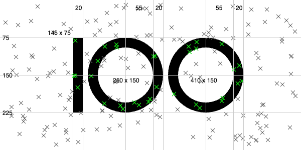

# code-100-puzzle-2024

## Assignment
We are looking for challengers for the CODE100 final at the WeAreDevelopers World Congress in Berlin on the 17-19th of July 2024. In order to apply, we want you to prove your solution finding chops by solving the following puzzle. All the information and the data you need is available on the 100 hits challenge page.


Here's what we want you to do: you get a dataset containing a coordinate system and lots of points in it. Your job is to tell us how many of these points are on the `100` logo if it were to be in that coordinate system. You can see all the dimensions of the logo in the following illustration.




You don't need to plot or paint them, just tell us which of these points would be part of the black pixels in the 100 logo. For example, in this case, only report the number of green pixels. If this were to be the dataset, the result would be `33`.

## Solution

The solution is in the `solution.py` file. The solution is a simple algorithm that checks if a point is inside the 100 logo. The algorithm is as follows:
1. define the logo as a list of shapes
2. load the coordinates from the dataset
3. for each point in the dataset check if it is inside any of the shapes
  - The algorithm checks if the point is inside a shape by checking if it is inside the bounding box of the shape and then checking if it is inside the shape itself.
  - for the zeros (donuts) the algorithm checks if the point is inside the outer circle and outside the inner circle.
4. return the number of points that are inside the logo 

Run the solution with the following command:
```bash
python solve.py
```

### verify the solution visually
To verify the solution visually, I created a simple plotter that plots the logo and the points. The plotter is in the `verify_solution.ipynb` file. Run the plotter with the following command:
```bash
jupyter notebook verify_solution.ipynb
```